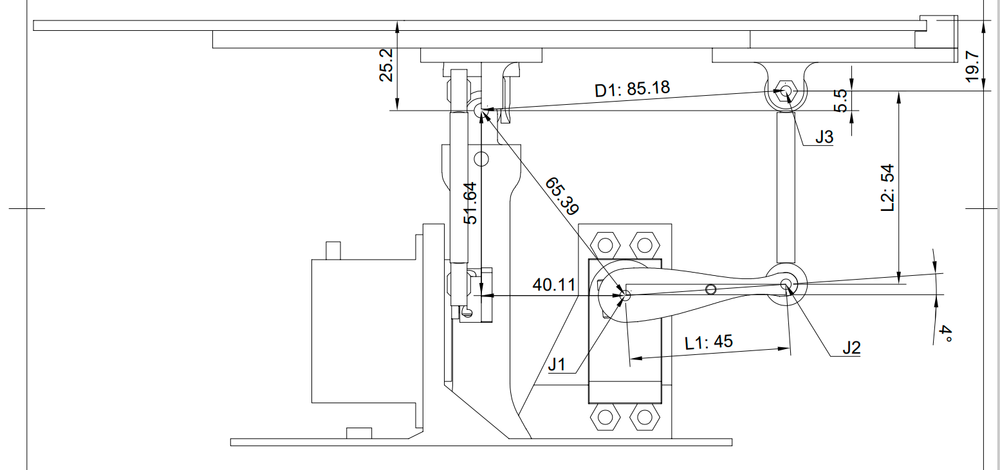
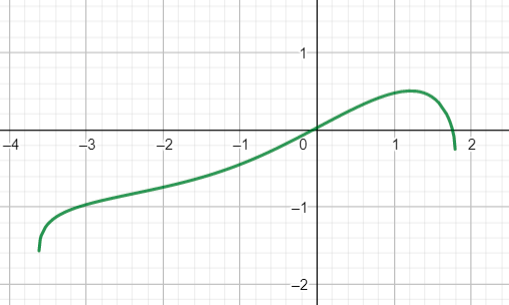

# ball-platform
A robot project made to balance a ball on a platform. The platform is controlled by two servo motors, and the ball's position is detected using a camera. A Raspberry Pi is the brain of the project, and calculates the incline of the plane needed to get the ball to the desired position. 


## Robot in action
[](https://www.youtube.com/watch?v=sYU_3XsPKic)

[](https://www.youtube.com/watch?v=nO7r-7b6NJc)

## Forward kinematics
This is the exact dimensions of the robot:

To calculate the forward kinematics, I simplified it to the following:

C is the center of the disk, and J1 is the center of rotation of the servo. J2 is where the servo-arm (L1) connects to the arm with ball-joints (L2). J3 is the location where the ball joint attaches to the disk. There are mainly two simplifications made in the model: in reality the disk pivots around a point that is offset from the disk and J3 is connected to the disk at an offset.

Given a fixed position of J2, we want to find the angle of the plane (v). We know that J3 must be a fixed distance from C (lie on the circle perimeter in blue). We also know that J2 and J3 are at a fixed distance from each other (L2).

Where J2 is given by 
```math
 (x, y) = (L1\cdot cos(u) + x(J1), L1\cdot sin(u) + y(J1))
```
where u is the angle of the servo located at J1, and x(J1) and y(J1) are the x- and y-position of J1 relative to C.

## Inverse kinematics
As the function used to calculate the forward kinematics is monotonic (at least with the dimensions of my robot), I did not bother calculating the inverse kinematics. Instead, I perform a binary search on the forward kinematics function (shown below, where the inputs will range from -1.05 to 0.82)



Martin Ansteensen 2022
